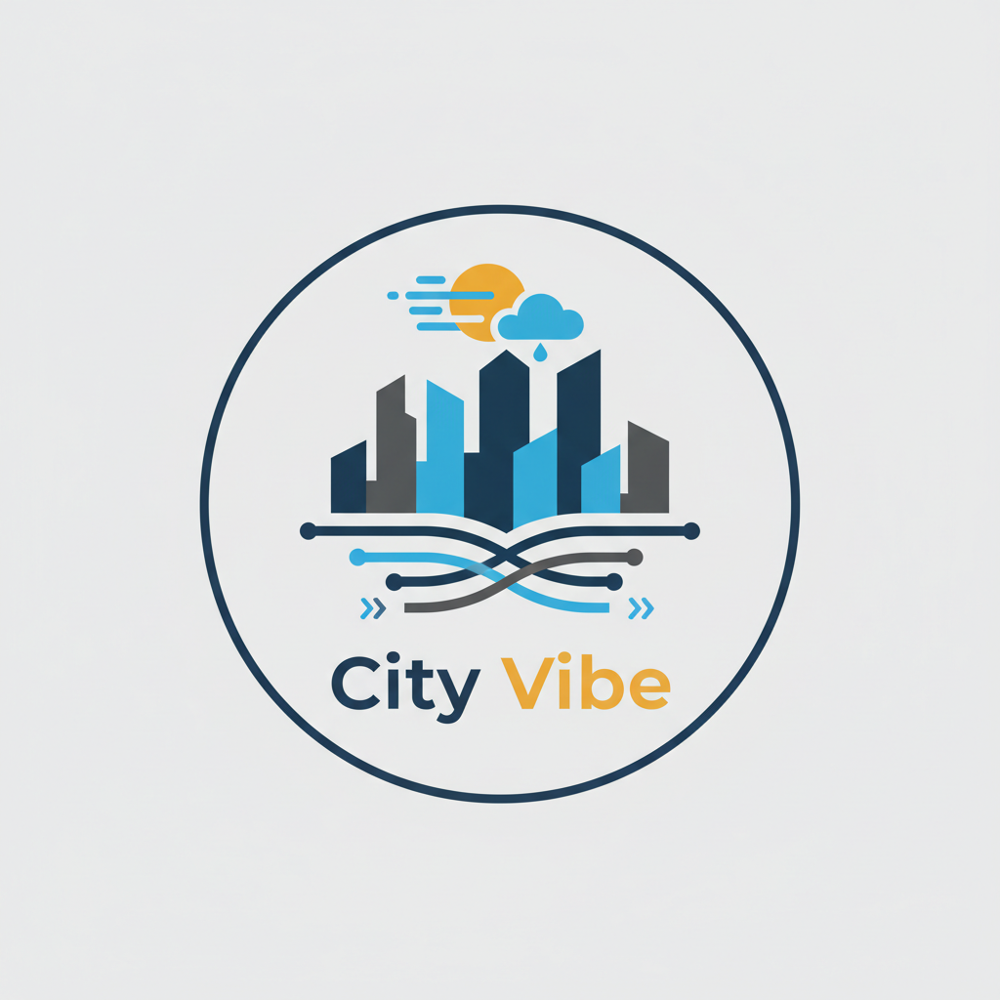
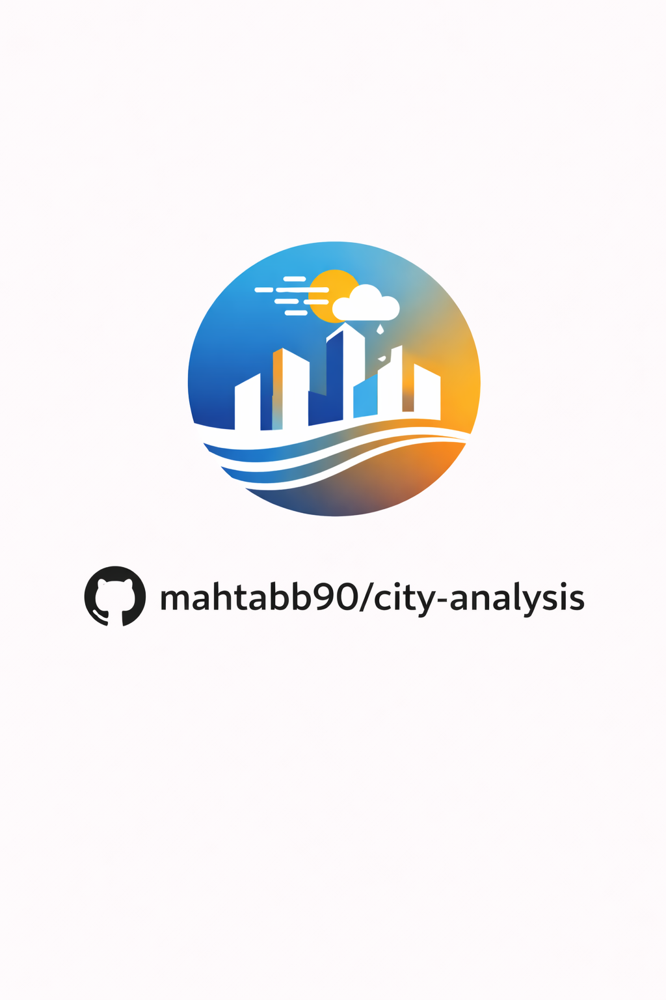

[![Contributors][contributors-shield]][contributors-url]
[![Stargazers][stars-shield]][stars-url]
[![Issues][issues-shield]][issues-url]


<!-- PROJECT LOGO -->
<br />
<div align="center">
  <a href="https://github.com/github_username/repo_name">
    
  </a>

<h3 align="center">City Vibe Analysis</h3>

  <p align="center">
    <b>Unlock the emotional pulse of your city with City Vibe Analysis! </b>
    <br>
    Our innovative platform goes beyond raw weather data, revealing the true "vibe" of urban environments. Predict moments of 'fredagskänsla' (Friday feeling) or 'hemtrevnad' (coziness) to empower businesses and city planners with unprecedented human-centric insights. Leverage historical trends and future forecasts to optimize urban experiences, enhance well-being, and drive engagement in your community. Discover the unseen emotional landscapes shaped by weather and traffic – transform your city into a truly responsive and harmonious space!
  </p>
  <p align="center">
    Helps cities and businesses understand the human side of weather by measuring urban atmosphere and predicting specific experiences (e.g., 'Friday feeling', 'coziness') using an automated pipeline for historical data collection and future forecasts. The project also saves multiple versions of weather forecasts over time to enable forecast precision analysis. Upon startup, predefined cities (`DEFAULT_CITIES`) are automatically geocoded, 60 days of historical weather and traffic data are retrieved and stored, and the city is marked as confirmed. Subsequently, current data for all confirmed cities is updated.
    <br />
    <a href="https://github.com/mahtabb90/city-analysis"><strong>Explore the docs »</strong></a>
    <br />
    <br />
    <a href="https://github.com/mahtabb90/city-analysis">View Demo</a>
    &middot;
    <a href="https://github.com/mahtabb90/city-analysis/issues/new?labels=bug&template=bug-report---.md">Report Bug</a>
    &middot;
    <a href="https://github.com/mahtabb90/city-analysis/issues/new?labels=enhancement&template=feature-request---.md">Request Feature</a>
  </p>
</div>


<!-- TABLE OF CONTENTS -->
<details>
  <summary>Table of Contents</summary>
  <ol>
    <li>
      <a href="#about-the-project">About The Project</a>
      <ul>
        <li><a href="#built-with">Built With</a></li>
      </ul>
    </li>
    <li>
      <a href="#getting-started">Getting Started</a>
      <ul>
        <li><a href="#prerequisites">Prerequisites</a></li>
        <li><a href="#installation">Installation</a></li>
      </ul>
    </li>
    <li><a href="#usage">Usage</a></li>
    <li><a href="#roadmap">Roadmap</a></li>
    <li><a href="#contributing">Contributing</a></li>
    <li><a href="#contact">Contact</a></li>
    <li><a href="#acknowledgments">Acknowledgments</a></li>
  </ol>
</details>


<!-- ABOUT THE PROJECT -->
## About The Project
<br />
<div align="center">
  <a href="https://github.com/github_username/repo_name">
    
  </a>

<p align="right">(<a href="#readme-top">back to top</a>)</p>


### Built With

* [![Python][Python-url]] (Just an example for now)


<p align="right">(<a href="#readme-top">back to top</a>)</p>


<!-- GETTING STARTED -->
## Getting Started

### Prerequisites

This project requires Python 3.8+ and pip.
* Python 3.8+
* pip
  ```sh
  python3 -m ensurepip --default-pip
  ```

### Installation

1. Clone the repo
   ```sh
   git clone https://github.com/mahtabb90/city-analysis.git
   ```
2. Create and activate a Python virtual environment
   ```sh
   python3 -m venv venv
   source venv/bin/activate
   ```
3. Install Python packages from requirements.txt
   ```sh
   pip install -r requirements.txt
   ```

<p align="right">(<a href="#readme-top">back to top</a>)</p>


<!-- USAGE EXAMPLES -->
## Usage

To use this project, activate your virtual environment and run the main script. Upon execution:

1.  **City Initialization**: The program will automatically geocode predefined cities (`DEFAULT_CITIES`) if they haven't been processed before.
2.  **Historical Data Collection**: For newly processed cities, 60 days of historical weather and traffic data will be fetched and stored.
3.  **Real-time Updates**: Current weather and traffic data will be fetched and updated for all confirmed cities.
4.  **Data Storage**: All collected data, including multiple versions of weather forecasts, will be saved to facilitate analysis of forecast precision.
5.  **Output**: The program will log its activities to `logs/city_vibe.log`, indicating data collection progress and status. Data will be stored in the `data/city_analysis.db` SQLite database, and generated reports/plots will be saved in the `reports/` directory.

To run the project:
```sh
source venv/bin/activate
python run.py --cli
```

<p align="right">(<a href="#readme-top">back to top</a>)</p>

<!-- ROADMAP -->
## Roadmap

Our vision for City Vibe Analysis unfolds in distinct phases, each building upon the last to deliver comprehensive urban insights:

-   **Phase 1: Core Data Infrastructure & Geocoding**
    -   Integrate robust Weather API (Open-Meteo) for comprehensive meteorological data.
    -   Implement Traffic Data acquisition (initially via MockdataAPI, with future real-time integrations).
    -   Develop a resilient Data Manager for seamless collection, storage, and retrieval of historical and current data.
    -   Automate geocoding for all `DEFAULT_CITIES` and establish initial 60-day historical data collection.

-   **Phase 2: Predictive Analytics & Vibe Modeling**
    -   Engineer the "Vibe Analyzer" module to correlate weather, traffic, and other urban metrics with human sentiments.
    -   Develop sophisticated algorithms to predict specific "city vibes" (e.g., 'fredagskänsla', 'hemtrevnad').
    -   Implement multi-version weather forecast saving for advanced forecast precision analysis.

-   **Phase 3: Visualization, Reporting & User Experience**
    -   Create dynamic visualizations to intuitively display city vibes, weather patterns, and traffic flows.
    -   Develop comprehensive reporting tools for businesses and city planners.
    -   Design and implement an intuitive user interface (CLI or web-based) for effortless interaction and insight generation.

See the [open issues](https://github.com/mahtabb90/city-analysis/issues) for a full list of proposed features (and known issues).

<p align="right">(<a href="#readme-top">back to top</a>)</p>


<!-- CONTRIBUTING -->
## Contributing

Contributions are what make the open source community such an amazing place to learn, inspire, and create. Any contributions you make are **greatly appreciated**.

If you have a suggestion that would make this better, please fork the repo and create a pull request. You can also simply open an issue with the tag "enhancement".
Don't forget to give the project a star! Thanks again!

1. Fork the Project
2. Create your Feature Branch (`git checkout -b feature/AmazingFeature`)
3. Commit your Changes (`git commit -m 'Add some AmazingFeature'`)
4. Push to the Branch (`git push origin feature/AmazingFeature`)
5. Open a Pull Request

<p align="right">(<a href="#readme-top">back to top</a>)</p>

### Top contributors:

<a href="https://github.com/mahtabb90/city-analysis/graphs/contributors">
  
</a>


<!-- LICENSE -->
## License

Distributed under the MIT License. See `LICENSE.txt` for more information.

<p align="right">(<a href="#readme-top">back to top</a>)</p>


<!-- CONTACT -->
## Contact

Your Name - Rasmus-skola@outlook.com

Project Link: [https://github.com/mahtabb90/city-analysis](https://github.com/mahtabb90/city-analysis)

<p align="right">(<a href="#readme-top">back to top</a>)</p>


<!-- GROUP RULES -->
## Rules to follow on start up.

First time start up:
1. Create a venv = python -m venv venv
2. Activate venv. 
   Mac/Linux = source venv/bin/activate
   Windows = venv\Scripts\activate

Every startup:
1. Activate venv.
2. Check Trello if there is anything to review.
3. If there is nothing to review, choose a card and branch out if needed.

When changes has been made and you are done:
1. Git add . or Git add "map-name"
2. Git commit -m "Message" (example "docs/yourmessage" if you have been working with a document).
3. Git push

<p align="right">(<a href="#readme-top">back to top</a>)</p>


<!-- MARKDOWN LINKS & IMAGES -->
<!-- https://www.markdownguide.org/basic-syntax/#reference-style-links -->
[contributors-shield]: https://img.shields.io/github/contributors/mahtabb90/city-analysis.svg?style=for-the-badge
[contributors-url]: https://github.com/mahtabb90/city-analysis/graphs/contributors
[forks-shield]: https://img.shields.io/github/forks/mahtabb90/city-analysis.svg?style=for-the-badge
[forks-url]: https://github.com/mahtabb90/city-analysis/network/members
[stars-shield]: https://img.shields.io/github/stars/mahtabb90/city-analysis.svg?style=for-the-badge
[stars-url]: https://github.com/mahtabb90/city-analysis/stargazers
[issues-shield]: https://img.shields.io/github/issues/mahtabb90/city-analysis.svg?style=for-the-badge
[issues-url]: https://github.com/mahtabb90/city-analysis/issues
[license-shield]: https://img.shields.io/github/license/mahtabb90/city-analysis.svg?style=for-the-badge
[license-url]: https://github.com/mahtabb90/city-analysis/blob/main/LICENSE.txt
[product-screenshot]: 

